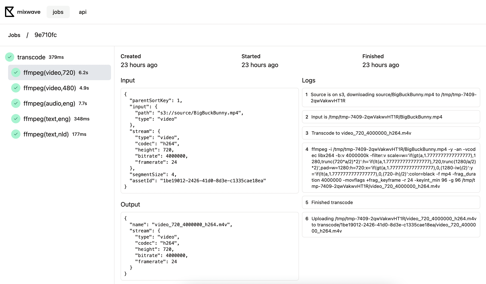

# Dashboard

The dashboard is a client application that visualizes running jobs, its statuses and has auto-generated API documentation based on the `spec.json` API endpoint. The API documentation is built with [Scalar](https://github.com/scalar/scalar). It's a React app and does not require separate a backend to function.

Typically, you'd want to build the dashboard once and upload it to `S3` to serve it as a static site. The dashboard is an SPA and requires no separate server / backend to function.

You can use the API docs to `Test Request`.

Each job, or child job, has detailed logs.

