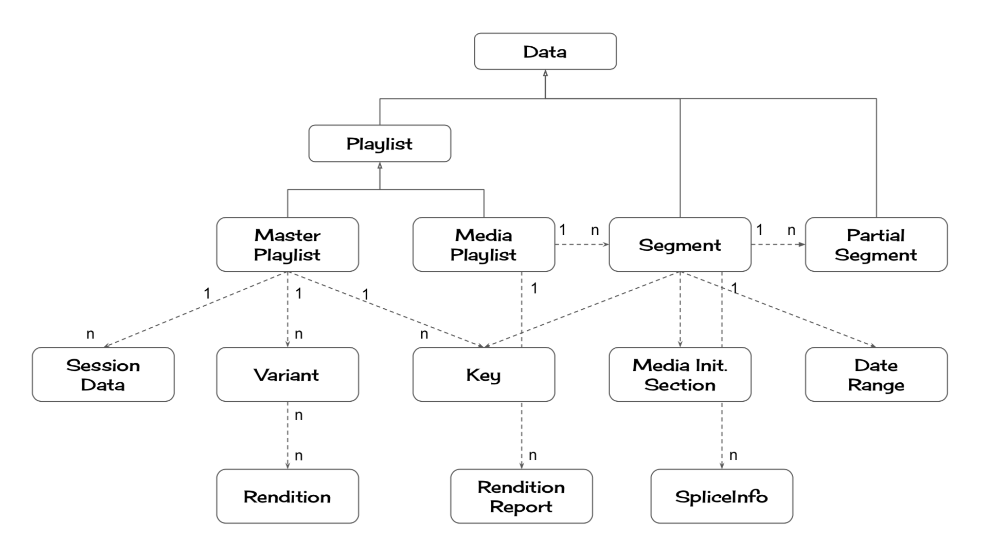

[](https://github.com/kuu/hls-parser/actions/workflows/tests.yml)
[](https://coveralls.io/github/kuu/hls-parser?branch=master)
[](https://snyk.io/test/github/kuu/hls-parser)
[](https://npmjs.com/hls-parser)
[](https://github.com/sindresorhus/xo)


# hls-parser

Provides synchronous functions to read/write HLS playlists (conforms to [the HLS spec rev.23](https://tools.ietf.org/html/draft-pantos-http-live-streaming-23), [the Apple Low-Latency Spec rev. 2020/02/05](https://developer.apple.com/documentation/http_live_streaming/protocol_extension_for_low-latency_hls_preliminary_specification), and [HLS.js's Low-Latency spec](https://github.com/video-dev/hlsjs-rfcs/blob/lhls-spec/proposals/0001-lhls.md))

## Install
[](https://nodei.co/npm/hls-parser/)
[](https://www.jsdelivr.com/package/npm/hls-parser?path=dist)

## Usage
```js
import { parse, types, stringify } from 'hls-parser';

// Parse the playlist
const playlist = parse(textData);
// You can access the playlist as a JS object
if (playlist.isMasterPlaylist) {
  // Master playlist
} else {
  // Media playlist
}
// Create a new playlist
const {MediaPlaylist, Segment} = types;
const obj = new MediaPlaylist({
  targetDuration: 9,
  playlistType: 'VOD',
  segments: [
    new Segment({
      uri: 'low/1.m3u8',
      duration: 9
    })
  ]
});
// Convert the object into a text
stringify(obj);
/*
#EXTM3U
#EXT-X-TARGETDURATION:9
#EXT-X-PLAYLIST-TYPE:VOD
#EXTINF:9,
low/1.m3u8
*/
```

## API

### `HLS.parse(str)`
Converts a text playlist into a structured JS object

#### params
| Name    | Type   | Required | Default | Description   |
| ------- | ------ | -------- | ------- | ------------- |
| str     | string | Yes      | N/A     | A text data that conforms to [the HLS playlist spec](https://tools.ietf.org/html/draft-pantos-http-live-streaming-23#section-4.1) |

#### return value
An instance of either `MasterPlaylist` or `MediaPlaylist` (See **Data format** below.)

### `HLS.stringify(obj, postProcess)`
Converts a JS object into a plain text playlist

#### params
| Name    | Type   | Required | Default | Description   |
| ------- | ------ | -------- | ------- | ------------- |
| obj     | `MasterPlaylist` or `MediaPlaylist` (See **Data format** below.)  | Yes      | N/A     | An object returned by `HLS.parse()` or a manually created object |
| postProcess     | PostProcess  | No      | undefined | A function to be called for each segment or variant to manipulate the output. |

##### `PostProcess`
| Property         | Type          | Required | Default | Description   |
| ---------------- | ------------- | -------- | ------- | ------------- |
| `segmentProcessor` | (lines: string[], start: number, end: number, segment: Segment, i: number) => void | No      | undefined     | A function to manipulate the segment output.  |
| `variantProcessor` | (lines: string[], start: number, end: number, variant: Variant, i: number) => void | No      | undefined     | A function to manipulate the variant output.  |


#### return value
A text data that conforms to [the HLS playlist spec](https://tools.ietf.org/html/draft-pantos-http-live-streaming-23#section-4.1)

### `HLS.setOptions(obj)`
Updates the option values

#### params
| Name    | Type   | Required | Default | Description   |
| ------- | ------ | -------- | ------- | ------------- |
| obj     | Object | Yes      | {}     | An object holding option values which will be used to overwrite the internal option values.  |

##### supported options
| Name       | Type    | Default | Description   |
| ---------- | ------- | ------- | ------------- |
| `strictMode` | boolean | false   | If true, the function throws an error when `parse`/`stringify` failed. If false, the function just logs the error and continues to run.|
| `allowClosedCaptionsNone` | boolean | false | If true, `CLOSED-CAPTIONS` attribute on the `EXT-X-STREAM-INF` tag will be set to the enumerated-string value NONE when there are no closed-captions. See [CLOSED-CAPTIONS](https://tools.ietf.org/html/rfc8216#section-4.3.4.2) |
| `silent` | boolean | false   | If true, `console.error` will be suppressed.|

### `HLS.getOptions()`
Retrieves the current option values

#### return value
A cloned object containing the current option values

### `HLS.types`
An object that holds all the classes described below.


## Data format
This section describes the structure of the object returned by `parse()` method.



### `Data`
| Property         | Type          | Required | Default | Description   |
| ---------------- | ------------- | -------- | ------- | ------------- |
| `type` | string     | Yes      | N/A     | Either `playlist` or `segment` or `part`}  |

### `Playlist` (extends `Data`)
| Property         | Type          | Required | Default | Description   |
| ---------------- | ------------- | -------- | ------- | ------------- |
| `isMasterPlaylist` | boolean     | Yes      | N/A     | `true` if this playlist is a master playlist  |
| `uri`              | string | No      | undefined     | Playlist URL  |
| `version`          | number | No       | undefined      | See [EXT-X-VERSION](https://tools.ietf.org/html/draft-pantos-http-live-streaming-23#section-4.3.1.2) |
| `independentSegments` | boolean | No       | false      | See [EXT-X-INDEPENDENT-SEGMENTS](https://tools.ietf.org/html/draft-pantos-http-live-streaming-23#section-4.3.5.1) |
| `start` | object({offset: number, precise: boolean}) | No       | undefined      | See [EXT-X-START](https://tools.ietf.org/html/draft-pantos-http-live-streaming-23#section-4.3.5.2) |
| `source` | string     | No      | undefined     | The unprocessed text of the playlist  |

### `MasterPlaylist` (extends `Playlist`)
| Property          | Type     | Required | Default   | Description   |
| ----------------- | -------- | -------- | --------- | ------------- |
| `variants`        | [`Variant`]  | No       | []        | See [ EXT-X-STREAM-INF](https://tools.ietf.org/html/draft-pantos-http-live-streaming-23#section-4.3.4.2) and [EXT-X-I-FRAME-STREAM-INF](https://tools.ietf.org/html/draft-pantos-http-live-streaming-23#section-4.3.4.3)  |
| `currentVariant`  | number   | No       | undefined | Array index that points to the chosen item in `variants` |
| `sessionDataList` | [`SessionData`]  | No       | []        | See [EXT-X-SESSION-DATA](https://tools.ietf.org/html/draft-pantos-http-live-streaming-23#section-4.3.4.4) |
| `sessionKeyList`      | [`Key`]    | No       | [] | See [EXT-X-SESSION-KEY](https://tools.ietf.org/html/draft-pantos-http-live-streaming-23#section-4.3.4.5) |

### `Variant`
| Property          | Type     | Required | Default   | Description   |
| ----------------- | -------- | -------- | --------- | ------------- |
| `uri`        | string  | Yes       | N/A        | URI of the variant playlist  |
| `isIFrameOnly`  | boolean   | No       | undefined | `true` if the variant is an I-frame media playlist. See [EXT-X-I-FRAME-STREAM-INF](https://tools.ietf.org/html/draft-pantos-http-live-streaming-23#section-4.3.4.3) |
| `bandwidth` | number  | Yes       | N/A        | See BANDWIDTH attribute in [EXT-X-STREAM-INF](https://tools.ietf.org/html/draft-pantos-http-live-streaming-23#section-4.3.4.2) |
| `averageBandwidth`      | number    | No       | undefined | See AVERAGE-BANDWIDTH attribute in [EXT-X-STREAM-INF](https://tools.ietf.org/html/draft-pantos-http-live-streaming-23#section-4.3.4.2) |
| `score`      | number    | No       | undefined | See SCORE attribute in [EXT-X-STREAM-INF](https://tools.ietf.org/html/draft-pantos-hls-rfc8216bis-08#section-4.4.6.2) |
| `codecs`      | string    | No       | undefined | See CODECS attribute in [EXT-X-STREAM-INF](https://tools.ietf.org/html/draft-pantos-http-live-streaming-23#section-4.3.4.2) |
| `resolution`      | object ({width: number, height: number})   | No       | undefined | See RESOLUTION attribute in [EXT-X-STREAM-INF](https://tools.ietf.org/html/draft-pantos-http-live-streaming-23#section-4.3.4.2) |
| `frameRate`      | number    | No       | undefined | See FRAME-RATE attribute in [EXT-X-STREAM-INF](https://tools.ietf.org/html/draft-pantos-http-live-streaming-23#section-4.3.4.2) |
| `hdcpLevel`      | string    | No       | undefined | See HDCP-LEVEL attribute in [EXT-X-STREAM-INF](https://tools.ietf.org/html/draft-pantos-http-live-streaming-23#section-4.3.4.2) |
| `allowedCpc`   | [object ({format: string, cpcList: [string]})]  | No       | undefined | See ALLOWED-CPC attribute in [EXT-X-STREAM-INF](https://tools.ietf.org/html/draft-pantos-hls-rfc8216bis-08#section-4.4.6.2) |
| `videoRange`      | string {"SDR","HLG","PQ"}    | No       | undefined | See VIDEO-RANGE attribute in [EXT-X-STREAM-INF](https://tools.ietf.org/html/draft-pantos-hls-rfc8216bis-08#section-4.4.6.2) |
| `stableVariantId`      | string   | No       | undefined | See STABLE-VARIANT-ID attribute in [EXT-X-STREAM-INF](https://tools.ietf.org/html/draft-pantos-hls-rfc8216bis-08#section-4.4.6.2) |
| `audio`      | [`Rendition`(type='AUDIO')]    | No       | [] | See AUDIO attribute in [EXT-X-STREAM-INF](https://tools.ietf.org/html/draft-pantos-http-live-streaming-23#section-4.3.4.2) |
| `video`      | [`Rendition`(type='VIDEO')]    | No       | [] | See VIDEO attribute in [EXT-X-STREAM-INF](https://tools.ietf.org/html/draft-pantos-http-live-streaming-23#section-4.3.4.2)  |
| `subtitles`      | [`Rendition`(type='SUBTITLES')]    | No       | [] | See SUBTITLES attribute in [EXT-X-STREAM-INF](https://tools.ietf.org/html/draft-pantos-http-live-streaming-23#section-4.3.4.2)  |
| `closedCaptions`      | [`Rendition`(type='CLOSED-CAPTIONS')]    | No       | [] | See CLOSED-CAPTIONS attribute in [EXT-X-STREAM-INF](https://tools.ietf.org/html/draft-pantos-http-live-streaming-23#section-4.3.4.2) |
| `currentRenditions`      | object ({audio: number, video: number, subtitles: number, closedCaptions: number})   | No       | {} | A hash object that contains array indices that points to the chosen `Rendition` for each type |

### `Rendition`
| Property          | Type     | Required | Default   | Description   |
| ----------------- | -------- | -------- | --------- | ------------- |
| `type`  | string   | Yes       | N/A | See TYPE attribute in [EXT-X-MEDIA](https://tools.ietf.org/html/draft-pantos-http-live-streaming-23#section-4.3.4.1) |
| `uri`        | string  | No       | undefined        | See URI attribute in [EXT-X-MEDIA](https://tools.ietf.org/html/draft-pantos-http-live-streaming-23#section-4.3.4.1)  |
| `groupId`  | string   | Yes       | N/A | See GROUP-ID attribute in [EXT-X-MEDIA](https://tools.ietf.org/html/draft-pantos-http-live-streaming-23#section-4.3.4.1) |
| `language` | string  | No       | undefined       | See LANGUAGE attribute in [EXT-X-MEDIA](https://tools.ietf.org/html/draft-pantos-http-live-streaming-23#section-4.3.4.1) |
| `assocLanguage` | string  | No       | undefined       | See ASSOC-LANGUAGE attribute in [EXT-X-MEDIA](https://tools.ietf.org/html/draft-pantos-http-live-streaming-23#section-4.3.4.1) |
| `name`  | string   | Yes       | N/A | See NAME attribute in [EXT-X-MEDIA](https://tools.ietf.org/html/draft-pantos-http-live-streaming-23#section-4.3.4.1) |
| `isDefault`  | boolean   | No       | false | See DEFAULT attribute in [EXT-X-MEDIA](https://tools.ietf.org/html/draft-pantos-http-live-streaming-23#section-4.3.4.1) |
| `autoselect`  | boolean   | No       | false | See AUTOSELECT attribute in [EXT-X-MEDIA](https://tools.ietf.org/html/draft-pantos-http-live-streaming-23#section-4.3.4.1) |
| `forced`  | boolean   | No       | false | See FORCED attribute in [EXT-X-MEDIA](https://tools.ietf.org/html/draft-pantos-http-live-streaming-23#section-4.3.4.1) |
| `instreamId`  | string   | No       | undefined | See INSTREAM-ID attribute in [EXT-X-MEDIA](https://tools.ietf.org/html/draft-pantos-http-live-streaming-23#section-4.3.4.1) |
| `characteristics`  | string   | No       | undefined | See CHARACTERISTICS attribute in [EXT-X-MEDIA](https://tools.ietf.org/html/draft-pantos-http-live-streaming-23#section-4.3.4.1) |
| `channels`  | string   | No       | undefined | See CHANNELS attribute in [EXT-X-MEDIA](https://tools.ietf.org/html/draft-pantos-http-live-streaming-23#section-4.3.4.1) |

### `SessionData`
| Property          | Type     | Required | Default   | Description   |
| ----------------- | -------- | -------- | --------- | ------------- |
| `id`  | string   | Yes       | N/A | See DATA-ID attribute in [EXT-X-SESSION-DATA](https://tools.ietf.org/html/draft-pantos-http-live-streaming-23#section-4.3.4.4) |
| `value`  | string   | No       | undefined | See VALUE attribute in [EXT-X-SESSION-DATA](https://tools.ietf.org/html/draft-pantos-http-live-streaming-23#section-4.3.4.4) |
| `uri`        | string  | No       | undefined        | See URI attribute in [EXT-X-SESSION-DATA](https://tools.ietf.org/html/draft-pantos-http-live-streaming-23#section-4.3.4.4)  |
| `language`  | string   | No       | undefined | See LANGUAGE attribute in [EXT-X-SESSION-DATA](https://tools.ietf.org/html/draft-pantos-http-live-streaming-23#section-4.3.4.4) |

### `MediaPlaylist` (extends `Playlist`)
| Property                    | Type     | Required | Default   | Description   |
| --------------------------- | -------- | -------- | --------- | ------------- |
| `targetDuration`            | number | Yes       | N/A        | See [EXT-X-TARGETDURATION](https://tools.ietf.org/html/draft-pantos-http-live-streaming-23#section-4.3.3.1) |
| `mediaSequenceBase`         | number | No       | 0        | See [EXT-X-MEDIA-SEQUENCE](https://tools.ietf.org/html/draft-pantos-http-live-streaming-23#section-4.3.3.2) |
| `discontinuitySequenceBase` | number | No       | 0        | See [EXT-X-DISCONTINUITY-SEQUENCE](https://tools.ietf.org/html/draft-pantos-http-live-streaming-23#section-4.3.3.3) |
| `endlist`                   | boolean | No       | false        | See [EXT-X-ENDLIST](https://tools.ietf.org/html/draft-pantos-http-live-streaming-23#section-4.3.3.4) |
| `playlistType`              | string | No       | undefined        | See [EXT-X-PLAYLIST-TYPE](https://tools.ietf.org/html/draft-pantos-http-live-streaming-23#section-4.3.3.5) |
| `isIFrame`                  | boolean | No       | undefined        | See [EXT-X-I-FRAMES-ONLY](https://tools.ietf.org/html/draft-pantos-http-live-streaming-23#section-4.3.3.6) |
| `segments`                  | [`Segment`] | No       | []        | A list of available segments |
| `prefetchSegments`          | [`PrefetchSegment`] | No       | []        | A list of available prefetch segments |
| `lowLatencyCompatibility`  | object ({canBlockReload: boolean, canSkipUntil: number, holdBack: number, partHoldBack: number})   | No       | undefined | See `CAN-BLOCK-RELOAD`, `CAN-SKIP-UNTIL`, `HOLD-BACK`, and `PART-HOLD-BACK` attributes in [EXT-X-SERVER-CONTROL](https://developer.apple.com/documentation/http_live_streaming/protocol_extension_for_low-latency_hls_preliminary_specification#3281374) |
| `partTargetDuration`            | number | No*      | undefined        | *Required if the playlist contains one or more `EXT-X-PART` tags. See [EXT-X-PART-INF](https://developer.apple.com/documentation/http_live_streaming/protocol_extension_for_low-latency_hls_preliminary_specification#3282434) |
| `renditionReports`  | [`RenditionReport`]   | No       | [] | Update status of the associated renditions |
| `skip`  | number   | No       | 0 | See [EXT-X-SKIP](https://developer.apple.com/documentation/http_live_streaming/protocol_extension_for_low-latency_hls_preliminary_specification#3282433) |

### `Segment` (extends `Data`)
| Property          | Type     | Required | Default   | Description   |
| ----------------- | -------- | -------- | --------- | ------------- |
| `uri`        | string  | Yes*       | N/A        | URI of the media segment. *Not required if the segment contains `EXT-X-PRELOAD-HINT` tag |
| `duration`  | number   | Yes*       | N/A | See [EXTINF](https://tools.ietf.org/html/draft-pantos-http-live-streaming-23#section-4.3.2.1) *Not required if the segment contains `EXT-X-PRELOAD-HINT` tag |
| `title`  | string   | No       | undefined | See [EXTINF](https://tools.ietf.org/html/draft-pantos-http-live-streaming-23#section-4.3.2.1) |
| `byterange`  | object ({length: number, offset: number})   | No       | undefined | See [EXT-X-BYTERANGE](https://tools.ietf.org/html/draft-pantos-http-live-streaming-23#section-4.3.2.2) |
| `discontinuity`  | boolean   | No       | undefined | See [EXT-X-DISCONTINUITY](https://tools.ietf.org/html/draft-pantos-http-live-streaming-23#section-4.3.2.3) |
| `mediaSequenceNumber`  | number   | No       | 0 | See the description about 'Media Sequence Number' in [3. Media Segments](https://tools.ietf.org/html/draft-pantos-http-live-streaming-23#page-5) |
| `discontinuitySequence`  | number   | No       | 0 | See the description about 'Discontinuity Sequence Number' in [6.2.1. General Server Responsibilities](https://tools.ietf.org/html/draft-pantos-http-live-streaming-23#section-6.2.1) |
| `key`  | `Key`   | No       | undefined | See [EXT-X-KEY](https://tools.ietf.org/html/draft-pantos-http-live-streaming-23#section-4.3.2.4) |
| `map`  | `MediaInitializationSection`   | No       | undefined | See [EXT-X-MAP](https://tools.ietf.org/html/draft-pantos-http-live-streaming-23#section-4.3.2.5) |
| `programDateTime`  | `Date`   | No       | undefined | See [EXT-X-PROGRAM-DATE-TIME](https://tools.ietf.org/html/draft-pantos-http-live-streaming-23#section-4.3.2.6) |
| `dateRange`  | `DateRange`   | No       | undefined | See [EXT-X-DATERANGE](https://tools.ietf.org/html/draft-pantos-http-live-streaming-23#section-4.3.2.7) |
| `markers`  | [`SpliceInfo`]   | No       | [] | SCTE-35 messages associated with this segment|
| `parts`  | [`PartialSegment`]   | No       | [] | Partial Segments that constitute this segment |
| `gap` | boolean | No | undefined | See [EXT-X-GAP](https://datatracker.ietf.org/doc/html/draft-pantos-hls-rfc8216bis#section-4.4.4.7) |

### `PartialSegment` (extends `Data`)
| Property          | Type     | Required | Default   | Description   |
| ----------------- | -------- | -------- | --------- | ------------- |
| `hint`        | boolean  | No       | false        | `true` indicates a hinted resource (`TYPE=PART`) See [EXT-X-PRELOAD-HINT](https://developer.apple.com/documentation/http_live_streaming/protocol_extension_for_low-latency_hls_preliminary_specification#3526694) |
| `uri`        | string  | Yes       | N/A        | See `URI` attribute in [EXT-X-PART](https://developer.apple.com/documentation/http_live_streaming/protocol_extension_for_low-latency_hls_preliminary_specification#3282436) |
| `duration`  | number   | Yes*       | N/A | See `DURATION` attribute in [EXT-X-PART](https://developer.apple.com/documentation/http_live_streaming/protocol_extension_for_low-latency_hls_preliminary_specification#3282436) *Not required if `hint` is `true`|
| `independent`  | boolean   | No       | undefined | See `INDEPENDENT` attribute in [EXT-X-PART](https://developer.apple.com/documentation/http_live_streaming/protocol_extension_for_low-latency_hls_preliminary_specification#3282436) |
| `byterange`  | object ({length: number, offset: number})   | No       | undefined | See `BYTERANGE` attribute in [EXT-X-PART](https://developer.apple.com/documentation/http_live_streaming/protocol_extension_for_low-latency_hls_preliminary_specification#3282436) |
| `gap`  | boolean   | No       | undefined | See `GAP` attribute in [EXT-X-PART](https://developer.apple.com/documentation/http_live_streaming/protocol_extension_for_low-latency_hls_preliminary_specification#3282436) |

### `PrefetchSegment` (extends `Data`)
| Property          | Type     | Required | Default   | Description   |
| ----------------- | -------- | -------- | --------- | ------------- |
| `uri`        | string  | Yes       | N/A        | See value of [EXT-X-PREFETCH](https://github.com/video-dev/hlsjs-rfcs/blob/lhls-spec/proposals/0001-lhls.md) |
| `discontinuity`  | boolean   | No       | undefined | See [EXT-X-PREFETCH-DISCONTINUITY](https://github.com/video-dev/hlsjs-rfcs/blob/lhls-spec/proposals/0001-lhls.md) |
| `mediaSequenceNumber`  | number   | No       | 0 | See the description about 'Media Sequence Number' in [3. Media Segments](https://tools.ietf.org/html/draft-pantos-http-live-streaming-23#page-5) |
| `discontinuitySequence`  | number   | No       | 0 | See the description about 'Discontinuity Sequence Number' in [6.2.1. General Server Responsibilities](https://tools.ietf.org/html/draft-pantos-http-live-streaming-23#section-6.2.1) |

### `Key`
| Property          | Type     | Required | Default   | Description   |
| ----------------- | -------- | -------- | --------- | ------------- |
| `method`  | string   | Yes       | N/A | See METHOD attribute in [EXT-X-KEY](https://tools.ietf.org/html/draft-pantos-http-live-streaming-23#section-4.3.2.4) |
| `uri`        | string  | No       | undefined        | See URI attribute in [EXT-X-KEY](https://tools.ietf.org/html/draft-pantos-http-live-streaming-23#section-4.3.2.4) |
| `iv`        | `ArrayBuffer`(length=16)   | No       | undefined        | See IV attribute in [EXT-X-KEY](https://tools.ietf.org/html/draft-pantos-http-live-streaming-23#section-4.3.2.4) |
| `format`  | string   | No       | undefined | See KEYFORMAT attribute in [EXT-X-KEY](https://tools.ietf.org/html/draft-pantos-http-live-streaming-23#section-4.3.2.4) |
| `formatVersion`  | string   | No       | undefined | See KEYFORMATVERSIONS attribute in [EXT-X-KEY](https://tools.ietf.org/html/draft-pantos-http-live-streaming-23#section-4.3.2.4) |

### `MediaInitializationSection`
| Property          | Type     | Required | Default   | Description   |
| ----------------- | -------- | -------- | --------- | ------------- |
| `hint`        | boolean  | No       | false        | `true` indicates a hinted resource (`TYPE=MAP`) See [EXT-X-PRELOAD-HINT](https://developer.apple.com/documentation/http_live_streaming/protocol_extension_for_low-latency_hls_preliminary_specification#3526694) |
| `uri`        | string  | Yes       | N/A        | See URI attribute in [EXT-X-MAP](https://tools.ietf.org/html/draft-pantos-http-live-streaming-23#section-4.3.2.5) |
| `byterange`        | object ({length: number, offset: number})   | No       | undefined        | See BYTERANGE attribute in [EXT-X-MAP](https://tools.ietf.org/html/draft-pantos-http-live-streaming-23#section-4.3.2.5) |

### `DateRange`
| Property          | Type     | Required | Default   | Description   |
| ----------------- | -------- | -------- | --------- | ------------- |
| `id`        | string  | Yes       | N/A        | See ID attribute in [EXT-X-DATERANGE](https://tools.ietf.org/html/draft-pantos-http-live-streaming-23#section-4.3.2.7) |
| `classId`        | string   | No       | undefined        | See CLASS attribute in [EXT-X-DATERANGE](https://tools.ietf.org/html/draft-pantos-http-live-streaming-23#section-4.3.2.7) |
| `start`        | `Date`  | No       | undefined        | See START-DATE attribute in [EXT-X-DATERANGE](https://tools.ietf.org/html/draft-pantos-http-live-streaming-23#section-4.3.2.7) |
| `end`        | `Date`  | No       | undefined        | See END-DATE attribute in [EXT-X-DATERANGE](https://tools.ietf.org/html/draft-pantos-http-live-streaming-23#section-4.3.2.7) |
| `duration`        | number  | No       | undefined        | See DURATION attribute in [EXT-X-DATERANGE](https://tools.ietf.org/html/draft-pantos-http-live-streaming-23#section-4.3.2.7) |
| `plannedDuration`        | number  | No       | undefined        | See PLANNED-DURATION attribute in [EXT-X-DATERANGE](https://tools.ietf.org/html/draft-pantos-http-live-streaming-23#section-4.3.2.7) |
| `endOnNext`        | boolean  | No       | undefined        | See END-ON-NEXT attribute in [EXT-X-DATERANGE](https://tools.ietf.org/html/draft-pantos-http-live-streaming-23#section-4.3.2.7) |
| `attributes`        | object  | No       | {}        | A hash object that holds SCTE35 attributes and user defined attributes. See SCTE35-* and X-<client-attribute> attributes in [EXT-X-DATERANGE](https://tools.ietf.org/html/draft-pantos-http-live-streaming-23#section-4.3.2.7) |

### `SpliceInfo`
Only `EXT-X-CUE-OUT` and `EXT-X-CUE-IN` tags are supported. Other SCTE-35-related tags are stored as raw (string) values.

| Property          | Type     | Required | Default   | Description   |
| ----------------- | -------- | -------- | --------- | ------------- |
| `type`  | string   | Yes       | N/A | {'OUT', 'IN', 'RAW'} |
| `duration`        | number   | No       | undefined        | Required if the `type` is 'OUT' |
| `tagName`        | string   | No       | undefined        | Holds the tag name if any unsupported tag are found. Required if the `type` is 'RAW' |
| `value`        | string   | No       | undefined        | Holds a raw (string) value for the unsupported tag. |

### `RenditionReport`
| Property          | Type     | Required | Default   | Description   |
| ----------------- | -------- | -------- | --------- | ------------- |
| `uri`        | string  | Yes       | N/A        | See `URI` attribute in [EXT-X-RENDITION-REPORT](https://developer.apple.com/documentation/http_live_streaming/protocol_extension_for_low-latency_hls_preliminary_specification#3282435) |
| `lastMSN`        | number  | No       | undefined  | See `LAST-MSN` attribute in [EXT-X-RENDITION-REPORT](https://developer.apple.com/documentation/http_live_streaming/protocol_extension_for_low-latency_hls_preliminary_specification#3282435) |
| `lastPart`        | number  | No       | undefined | See `LAST-PART` attribute in [EXT-X-RENDITION-REPORT](https://developer.apple.com/documentation/http_live_streaming/protocol_extension_for_low-latency_hls_preliminary_specification#3282435) |
